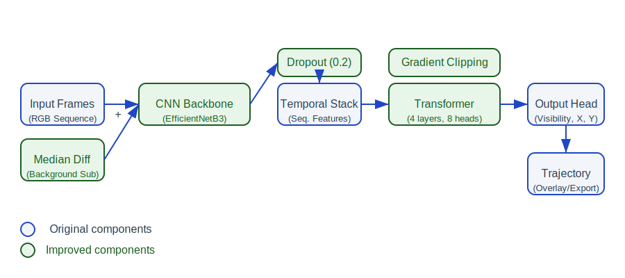

# 🏸 ShuttleTrack: Transformer-CNN Hybrid for Shuttlecock Detection and Trajectory Tracking

## 📌 Project Objective
Design and implement a **novel AI system** for detecting and tracking shuttlecock motion in **badminton videos** with international-match-level accuracy, providing a **trajectory overlay** on the video output.

> 🎯 This model generalizes to unseen badminton videos and aims to outperform traditional techniques like YOLO + Kalman or TrackNetV2.

---

## 🚀 Key Innovations
- **Hybrid CNN + Temporal Transformer Backbone:** Combines CNN's spatial precision with a TransformerEncoder's temporal modeling.
- **Temporal Fusion:** Multi-frame input for motion context.
- **Frame Difference Module:** Explicit motion guidance.
- **Trajectory Inpainting:** Fills detection gaps using spatiotemporal consistency.
- **Trajectory Overlay:** Broadcast-quality visual output.

---

## 🏗️ Model Architecture



---

## ⚡ How to Run (Step-by-Step)

### ⚙️ Device (CPU/GPU) & Batch Size
- **Device selection:**
  - Open `config/shuttletrack.yaml` and set:
    ```yaml
    device: cuda  # for GPU (recommended if available)
    device: cpu   # for CPU (safe for low-end PCs)
    ```
  - If you set `cuda` but no GPU is available, the code will automatically fall back to CPU (no crash).
- **Batch size:**
  - In the same config file, adjust:
    ```yaml
    batch_size: 16  # decrease if you run out of memory, especially on CPU or low-end GPU
    ```
- **Tip:** For low-resource machines, use `device: cpu` and a small `batch_size` (e.g., 2 or 4).

### 1. **Install Requirements**
```bash
pip install -r requirements.txt
```

### 2. **Data Preprocessing**
Prepare your dataset in the `ShuttleCockFrameDataset` format, then run:
```bash
python scripts/preprocess.py
```

### 3. **Test Data Loader**
```bash
python test/test_dataset.py
```

### 4. **Test Model Instantiation**
```bash
python test/test_model.py
```

### 5. **Train the Model**
```bash
python scripts/train.py
```

### 6. **Validation & Visualization**
- Evaluate metrics: see `utils/eval.py` for usage in your own scripts.
- Visualize predictions:
```bash
python scripts/visualize_predictions.py
```

### 7. **Inference on New Videos**
```bash
python scripts/infer.py --video path_to_video.mp4 --output predictions.csv --checkpoint checkpoint_best.pth
python scripts/visualize.py --video path_to_video.mp4 --predictions predictions.csv --output output_with_trajectory.mp4
```

### 8. **Interactive Streamlit App**
```bash
streamlit run streamlit_app.py
```
- Upload your trained model and a video.
- See real-time logs and the output video with trajectory overlay.

### 9. **Benchmarking**
Compare ShuttleTrack to baselines:
```bash
python utils/benchmark.py --ours predictions.csv --baseline baseline.csv --gt ground_truth.csv --output results/benchmark_report.md
```

---

## 📦 Dataset Format
- Input: Badminton video sequences (30–60 FPS), frame-wise shuttlecock annotations (Frame,Visibility,X,Y)
- Output: Shuttlecock positions and trajectory overlay

---

## 📘 References
- TrackNetV2/V3 (NCTU, 2019–2021)
- TrackFormer (ECCV 2022)
- Swin Transformer (Microsoft Research)
- ShuttleSet Dataset (CoachAI)

---

## 📫 Contact
maheshsharan28@gmail.com